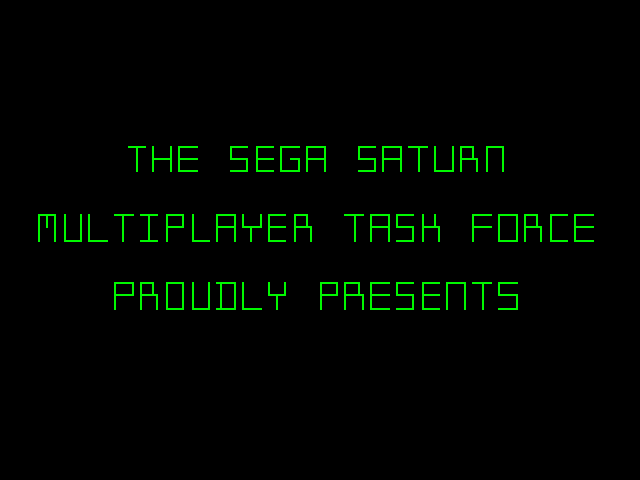
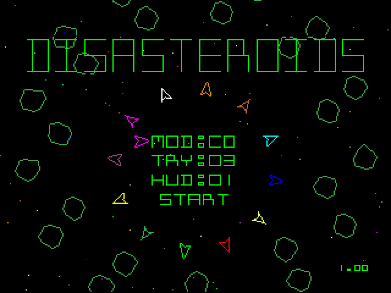
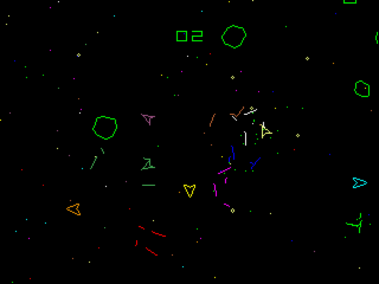
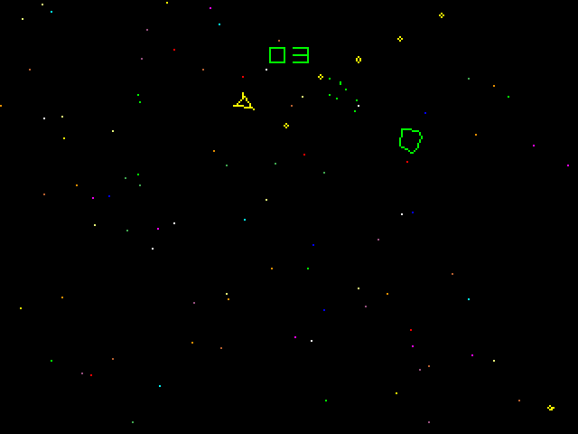
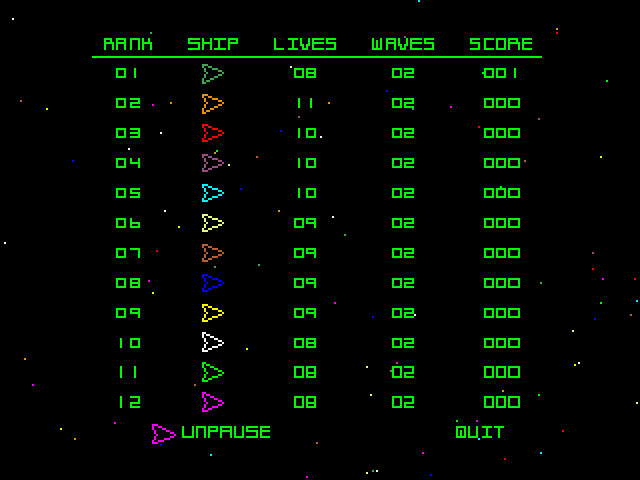

# Disasteroids
Disasteroids is a 12-player Asteroids clone for the Sega Saturn. Requires two [6 Player Adaptors](https://segaretro.org/Saturn_6_Player_Adaptor) for full twelve player support. Requires a modded Saturn or another method to get code running on actual hardware. Build the code with Jo Engine or grab an ISO from [releases](https://github.com/slinga-homebrew/Disasteroids/releases).  

Disasteroids was my entry to the [Sega Saturn 28th Anniversary Game Competition](https://segaxtreme.net/threads/sega-saturn-28th-anniversary-game-competition.25278/).  

## Screenshots

## How to Play
* Plug in as many controllers/multitaps as you have  
* Select a game mode (CO-OP or Versus)  
  * CO-OP mode is 1-12 players. Try to last for as many waves as possible. Game ends when all players are out of lives. Colliding players will bounce off of each other. Player projectiles will cause other players to bounce, not die.  
  * Versus mode will not start if you do not have at least two controllers plugged in. Game ends when there is only one player left. Player projectiles will destroy other players  
* Try is the number of lives  
* HUD is the color of the display  

## Game Controls
* A/C to shoot
* Up/B to thrust
* Left/Right to angle your ship
* X to change your ship color (doesn't work if all 12 colors are used)

## Player One Special Commands
Only player one can:  
* interact with the menus  
* pause/display the score with the Start button  
* Press Y to change the HUD color  
* Press Z for debugging info  
* Press ABC + Start to reset the game   

## Burning
On Linux I was able to burn the ISO/CUE + WAV with: cdrdao write --force game.cue.   

## Building
Requires Jo Engine to build. Checkout source code folder to your Jo Engine "Projects" directory and run "./compile.sh".   
 
## Credits
Thank you to Reyeme for the disasteroid generation algorithm, advice   
Thank you to EmeraldNova and KnightOfDragon for basic geometry refresher, advice   
Lots of advice and feedback from the #segaxtreme Discord (Fafling, Ndiddy, Ponut, and more)   
Title Song: [Powerup!](https://www.youtube.com/watch?v=l7SwiFWOQqM) by Jeremy Blake. No Copyright.  
Game Over Song: [Dub Hub](hhttps://www.youtube.com/watch?v=in8hEbX9mM8) by Jimmy Fontanez. No Copyright.  
Thank you to [Emerald Nova](www.emeraldnova.com) for organizing the Saturn Dev contest  
[SegaXtreme](http://www.segaxtreme.net/) - The best Sega Saturn development forum on the web. Thank you for all the advice from all the great posters on the forum.  
[Jo Engine](https://github.com/johannes-fetz/joengine) - Sega Saturn dev environment

